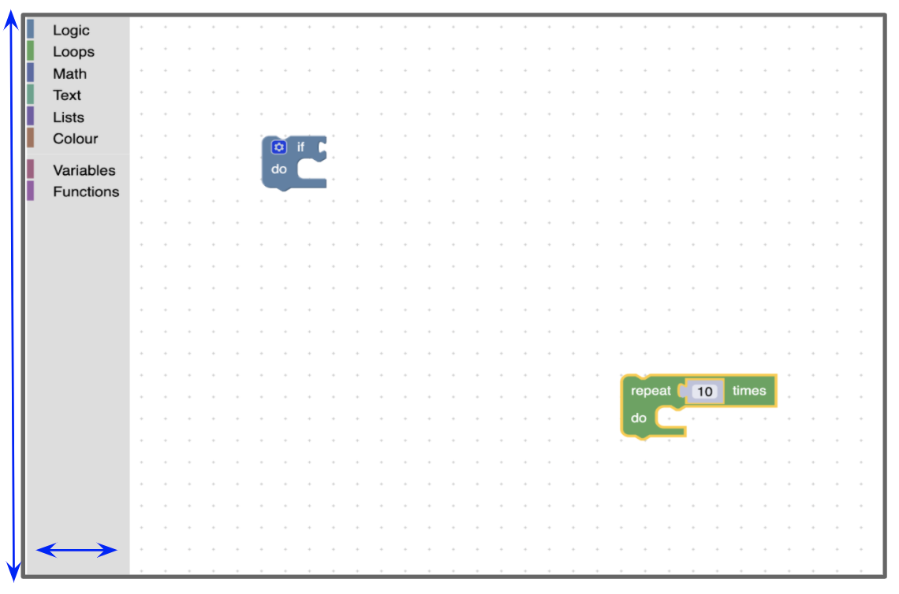
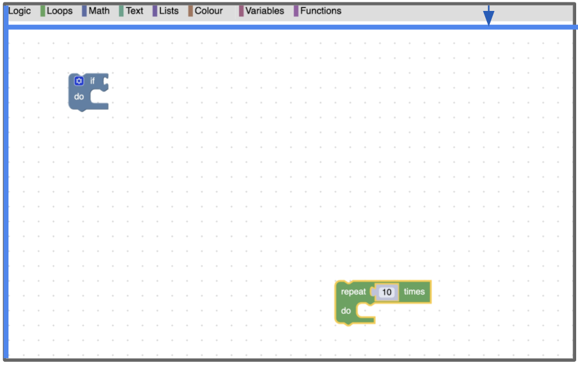

<!--
 * @Date: 2021-10-15 14:06:13
 * @LastEditors: tortorse
 * @LastEditTime: 2021-10-18 09:28:11
 * @FilePath: \blockly-document-chinese\docs\guides\plugins\interfaces\metrics_manager.md
-->
# 度量管理器

度量管理器收集和报告与 Blockly 工作区有关的所有度量。本指南描述了从度量管理器返回的每组度量的含义。有关度量管理器的更多信息，您还可以观看我们的 [2021 Metrics Deep Dive](https://www.youtube.com/watch?v=6e6vntCqbic&list=PLSIUOFhnxEiCjoIwJ0jAdwpTZET73CK7d&index=9)。


## 度量

### 工具箱度量

`workspace.getMetricsManager().getToolboxMetrics();`

工具箱度量由 `height`、`width` 和 `position` 类别工具箱组成。这不包括附加到工具箱的弹出窗口的信息。



该工具箱 `position` 属于 `Blockly.utils.toolbox.Position` 类型。


### 弹窗度量

`workspace.getMetricsManager().getFlyoutMetrics();`

弹窗度量由 `height`、`width` 和 `position` 弹出式工具箱组成。需要注意的是，这不是附加到类别工具箱的弹出窗口。这仅适用于弹出工具箱，如下图所示。


该弹窗 `position` 属于 `Blockly.utils.toolbox.Position` 类型。

### SVG 度量

`workspace.getMetricsManager().getSvgMetrics();`

SVG 度量由工作区的父 SVG 的 `width` 和 `height` 组成。对于主工作区，这是带有 `blocklySvg` 类的 SVG 。此 SVG 包括可见的工作区和工具箱。


### 视图度量

`workspace.getMetricsManager().getViewMetrics(opt_getWorkspaceCoordinates);`

视图度量由视口的 `height`，`width`，`top` 和 `left` 组成。视口是工作区中可见的部分。不包括任何一种工具箱。


左上角相对于工作区原点。当我们在工作区中拖动时，视口的顶部和左侧位置会更新。


### 绝对度量

`workspace.getMetricsManager().getAbsoluteMetrics();`

绝对度量由视口相对父 SVG 的 `top` 与 `left` 偏移量组成。根据工具箱在工作区上的位置，它通常是工具箱的宽度或高度。




### 内容度量

`workspace.getMetricsManager().getContentMetrics(opt_getWorkspaceCoordinates);`

内容度量由围绕任意块或工作区注释的盒边界的 `height`，`width`，`top`及 `left` 组成。

:::tip 提示
内容度量不考虑块注释，只考虑 [工作区注释]([https://developers.google.com/blockly/reference/js/Blockly.WorkspaceComment)。
:::


### 滚动度量

`workspace.getMetricsManager().getScrollMetrics(opt_getWorkspaceCoordinates);`

滚动度量由可滚动区域的 `height`，`width`，`top` 和 `left` 组成。对于可移动的工作区，可滚动区域是内容区域加上一些内边距。


## 坐标系

默认情况下，度量管理器计算的所有度量都作为像素坐标返回。在适用的情况下，可以通过传入 `true` 给度量方法来获取工作区坐标中的某些度量。例如， `metricsManager.getViewMetrics(true)`。

```
workspaceCoordinate = pixelCoordinates / workspace.scale
```

工作区坐标通常用于位于工作区上的项目，例如块和工作区注释。工作区坐标不会随着用户放大和缩小而改变。


## 覆盖度量

希望为工作区提供自己的度量标准的开发人员可以注册一个实现了 `IMetricsManager` 接口的替代指标管理器 或扩展 `Blockly.MetricsManager`。

在 [Continuous Toolbox plugin](https://github.com/google/blockly-samples/blob/master/plugins/continuous-toolbox/src/ContinuousMetrics.js) 插件或 [Fixed Edges plugin](https://github.com/google/blockly-samples/blob/master/plugins/fixed-edges/src/index.js)中可以找到一个例子。

